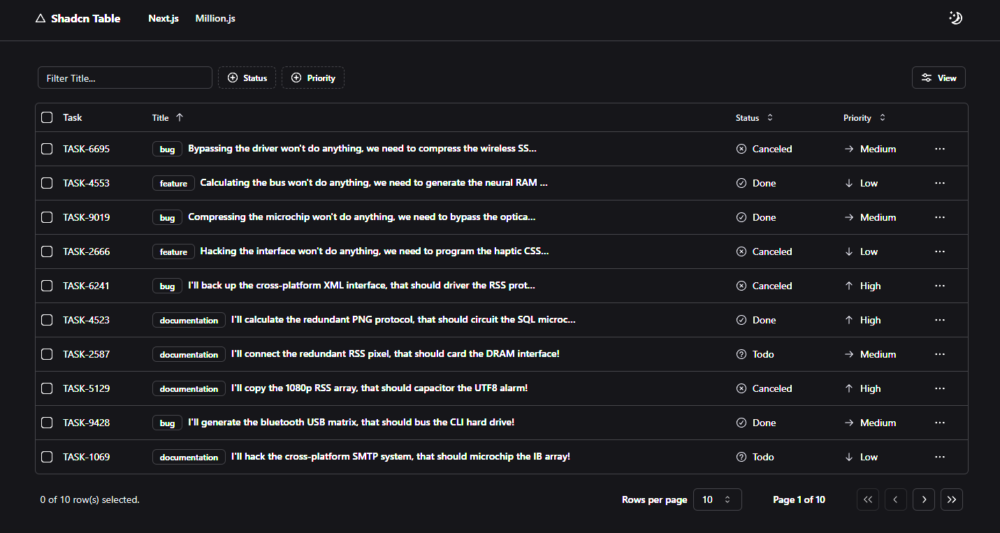

# [Shadcn Table](https://table.sadmn.com)

This is a shadcn table with server-side sorting, filtering, and pagination. It is bootstrapped with `create-t3-app`.

[](https://table.sadmn.com)

> **Warning**
> This project is still in development and is not ready for production use.
>
> It uses new technologies (ppr, react compiler) which are subject to change and may break your application.

## Tech Stack

- **Framework:** [Next.js](https://nextjs.org)
- **Styling:** [Tailwind CSS](https://tailwindcss.com)
- **UI Components:** [shadcn/ui](https://ui.shadcn.com)
- **Table package:** [TanStack/react-table](https://tanstack.com/table/latest)
- **Database:** [Neon](https://neon.tech)
- **ORM:** [Drizzle ORM](https://orm.drizzle.team)
- **Validation:** [Zod](https://zod.dev)

## Features

- [x] Server-side pagination, sorting, and filtering (via `useDataTable` hook)
- [x] Customizable columns (`dataTable` and `columns` props)
- [x] Dynamic debounced search filters, and faceted filters (`filterFields` prop)
- [x] Dynamic `Data-Table-Toolbar` with search, filters, and actions
- [x] Optional `Notion` like advanced filtering (`enableAdvancedFilter` prop)
- [x] Optional `Linear` like floating bar on row selection (`floatingBar` prop)

## Running Locally

1. Clone the repository

   ```bash
   git clone https://github.com/sadmann7/shadcn-table
   ```

2. Install dependencies using pnpm

   ```bash
   pnpm install
   ```

3. Copy the `.env.example` to `.env` and update the variables.

   ```bash
   cp .env.example .env
   ```

4. Start the development server

   ```bash
   pnpm run dev
   ```

5. Push the database schema

   ```bash
   pnpm run db:push
   ```

## Build your own Table

1. Copy the following folders and files into your project (configured with ) at the exact specific locations

   - `src/components/data-table`
   - `src/db/index.ts`
   - `src/hooks`
   - `src/lib`
   - `src/types`

   Also install the required shadcn components and other required packages with the following commands:

   ```bash
   pnpm dlx shadcn@latest init

   pnpm dlx shadcn@latest add badge button calendar checkbox command dialog dropdown-menu form input label popover select separator skeleton sonner table toggle-group tooltip drawer

   pnpm add drizzle-orm postgres @tanstack/react-table zod @t3-oss/env-nextjs
   pnpm add -D drizzle-kit dotenv-cli pg tsx
   ```

2. Configure your Environment Variables
   Then set up the Database URL, for this example, we're using PlanetScale MySQL2 Database. Our schemas will also be made using this.

3. Database Actions: For this you can use any ORM of your choice, but for the sake of this particular example, we're using [Drizzle ORM](https://orm.drizzle.team) and [Neon](https://neon.tech/).

   As an example, lets use the `tasks` table.

   - Create the Table Schema at `@/db/schema.ts`
   - Create the associated zod validations `@/lib/validations/tasks.ts` file

4. Setting up the Table

   - **Create Files**: Create `page.tsx` and, if needed, `layout.tsx` in your app directory.
   - **Copy Directories**: Copy `./_components` and `./_lib` directories into your project.
   - **Update Queries/Mutations**: Modify `./_lib/queries.ts`, and `./_lib/actions.ts` to match your database operations.
   - **Update Floating Bar**: Update `./_components/tasks-table-floating-bar.tsx` to match your table's actions (optional).
   - **Define Table Columns**: Update `./_components/tasks-table-columns.tsx` to define column headers, actions, searchable and filterable columns.
   - **Setup Data Fetching**: In `./page.tsx`, define `getTasksPromise`, `getTaskCountByStatus`, and `getTaskCountByPriority`.
   - **Fetch Data**: In `./_components/tasks-table.tsx`, consume the `getTasksPromise` promise using the `React.use` hook. The promise is passed to trigger the `suspense` boundary.
   - **Memoize Table Columns**: In `./_components/tasks-table.tsx`, memoize columns defined in `./_components/tasks-table-columns.tsx` using `React.useMemo` hook to prevent unnecessary re-renders.
   - **Use Data Table Hook**: In `./_components/tasks-table.tsx`, call `./hooks/useTasksTable.tsx` hook to handle server-side pagination, sorting, and filtering.
   - **Remove Tasks Table Provider**: Make sure to remove the provider from `./components/tasks-table-provider.tsx`. The provider is used to showcase some additional features like floating bar and advanced filters.

## Codebase Overview

Watch the codebase overview video on [YouTube](https://www.youtube.com/watch?v=BsvjF5Y6-C8&t=1s).

Consider subscribing to Kavin Desi Valli's [YouTube channel](https://www.youtube.com/@livecode247) for more videos.

## How do I deploy this?

Follow the deployment guides for [Vercel](https://create.t3.gg/en/deployment/vercel), [Netlify](https://create.t3.gg/en/deployment/netlify) and [Docker](https://create.t3.gg/en/deployment/docker) for more information.
